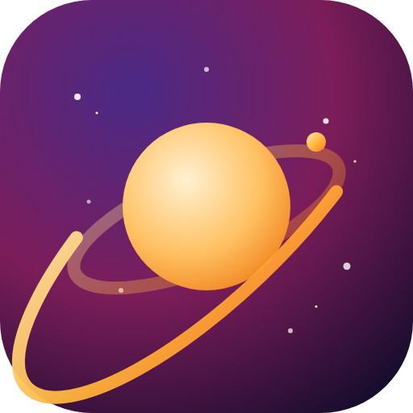
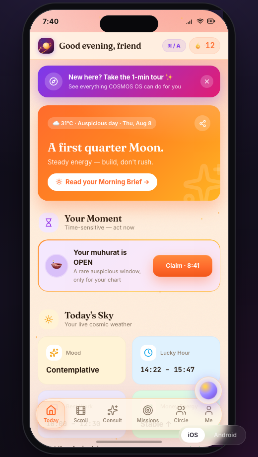
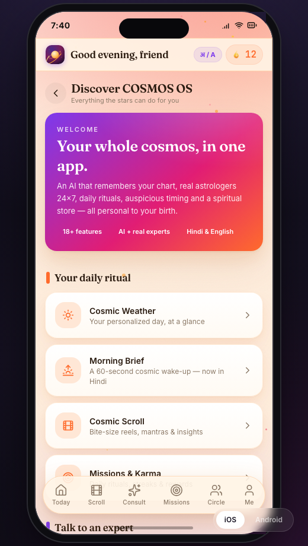
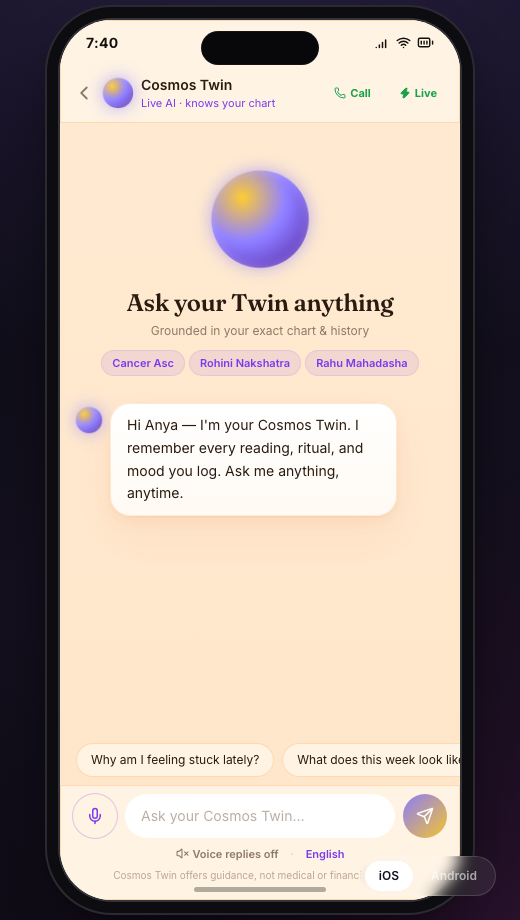
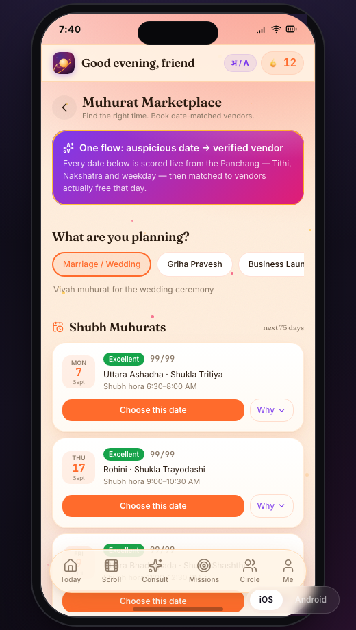
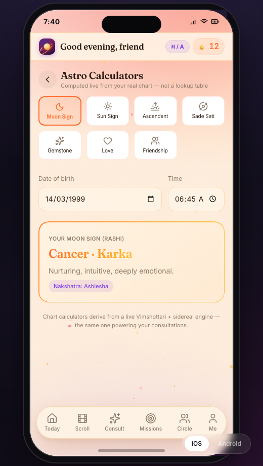
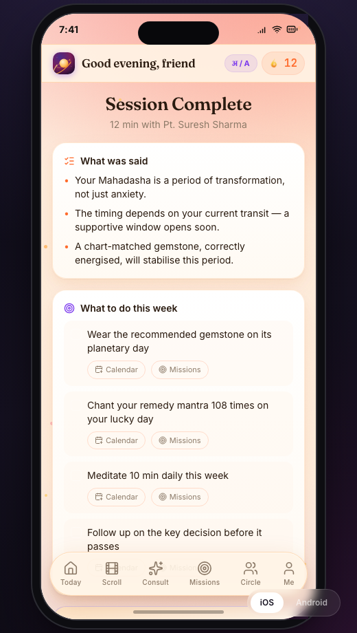

<div align="center">



# COSMOS OS

### The AI-Powered Life Operating System — built for AstroLive

*Astrology today is something you **buy**. COSMOS OS makes it something you **live** —
an app you open every morning, that remembers your whole chart, and turns every
consultation into a personalized ritual you actually complete.*

<br/>

[](https://cosmos-os-alpha.vercel.app/)


**AstroHack 2026 · Team DigiSeva** · a fully-working prototype (~25 screens, real APIs, zero dead buttons)

</div>

---

## ✦ The insight that drives everything

> **AstroTalk — the market leader (₹1,176 Cr FY25) — did ₹140 Cr in ecommerce in year one. But less than 3% of it came from in-app cross-sell during consultations.** The other 97%+ is browser-first, decoupled from the astrologer.

That's a **₹130 Cr/year hole** in the market leader's product: the single most valuable moment — a user actively consulting an astrologer, *in the app, right now* — is monetized at under 3% of its potential. **COSMOS OS is the product that closes that seam** — while also building the daily-habit loop (Co-Star scaled to 30M+ users on exactly this) that Indian consultation-first apps have never shipped.

One architecture proves all four AstroHack axes: **Virality · Habit · New Revenue · USP.**

---

## 📱 Screens

<div align="center">
<table>
<tr>
<td align="center"><br/><sub><b>Cosmic Weather</b> · daily habit surface</sub></td>
<td align="center"><br/><sub><b>Discover</b> · in-app feature tour</sub></td>
<td align="center"><br/><sub><b>Cosmos Twin</b> · 24×7 AI astrologer</sub></td>
</tr>
<tr>
<td align="center"><br/><sub><b>Muhurat Marketplace</b> · dates → vendors</sub></td>
<td align="center"><br/><sub><b>Astro Calculators</b> · live from your chart</sub></td>
<td align="center"><br/><sub><b>AI Consultation Summary</b></sub></td>
</tr>
</table>
</div>

---

## ⚡ What it does

| # | Feature | Why it's different |
|---|---------|--------------------|
| 🧠 | **AI Memory Brain** | Every astrologer sees a private "Life Snapshot" — your chart, dasha, focus, open predictions. Context that compounds. |
| 💎 | **Ritual Moment** | Mid-consultation, an AI reads your chart + the conversation and surfaces the exact remedy — one-tap Buy Now. *The ₹130 Cr fix.* |
| 🔮 | **Cosmos Twin (AI)** | A 24×7 GPT-powered astrologer that already knows your computed chart — Hindi & English. |
| 📞 | **Call Cosmo** | Dial a real **Sarvam AI** voice agent for a spoken consultation. |
| 🗓️ | **Muhurat Marketplace** | Panchang-scored auspicious dates → verified vendors free that day → booking. A brand-new revenue vertical. |
| 🧮 | **Astro Calculators** | Moon sign, Ascendant, **Sade Sati**, Gemstone — computed live from a real Vimshottari + sidereal engine, not a lookup table. |
| 📈 | **Prediction Tracker + Warranty** | Every prediction is scored post-hoc; <60% accuracy → refund. Trust as a USP. |
| ☀️ | **Morning Brief** | A 60-second cosmic wake-up, narrated in a natural **Hindi voice** (Sarvam TTS). |
| 🔥 | **Habit loop** | Streaks, Karma, daily missions, Cosmic Scroll (reels) — the Co-Star engagement loop, localized. |
| 🛍️ | **Astro Store** | Chart-matched gemstones, rudraksha, remedies — real Razorpay checkout. |

*…plus real webcam video calls, Kundli matching, festival cards, an Aura score, and a PWA install.*

---

## 🏗️ Architecture

```
┌── LAYER 4 · DISTRIBUTION ───────────────────────────┐
│   Cosmic Cards · Compatibility · Festival shares    │
├── LAYER 3 · DAILY HABIT SURFACE ────────────────────┤
│   Cosmic Weather · Missions · Streaks · Panchang    │
├── LAYER 2 · CONSULTATION + COMMERCE ────────────────┤
│   Consult · Ritual Moment · Prediction Tracker      │
├── LAYER 1 · AI MEMORY BRAIN  (the moat) ────────────┤
│   Chart · Dasha · History · Goals · Mood            │
└─────────────────────────────────────────────────────┘
```

Secret keys never touch the browser — a **Supabase Edge Function** (`supabase/functions/cosmos-api`) proxies every privileged call.

---

## 🔌 Real integrations (not mocked)

| Service | Used for |
|---------|----------|
| **OpenAI** (gpt-4o-mini) | Cosmos Twin, AI ritual/summary/prediction |
| **Sarvam AI** | Natural Hindi TTS + the Call Cosmo voice agent |
| **Prokerala** | Real kundli / panchang / matching ephemeris |
| **100ms** | Video-call room tokens |
| **Razorpay** | Store + Muhurat vendor checkout (test mode) |
| **Open-Meteo** | Live weather in the daily brief (keyless) |
| **Supabase** | Edge Function (secure API proxy) + analytics |

A client-side **Vimshottari Dasha engine** (`src/lib/chart.ts`) derives every user's real chart on-device, so the app is fully personalized even offline.

---

## 🚀 Run it locally

```bash
git clone https://github.com/DG10911/cosmos-os.git
cd cosmos-os
npm install
npm run dev          # http://localhost:5173
```

```bash
npm run build        # production build
npm run preview      # preview the build
node scripts/test-keys.mjs   # ping every configured API key
```

Copy `.env.example` → `.env` and add keys to unlock the live-API features (the app degrades gracefully without them). Client keys build into the bundle; server secrets live only in the Supabase Edge Function.

---

## 🧱 Tech stack

**React 19 · TypeScript · Vite · Tailwind · Framer Motion · React Router (HashRouter) · Supabase Edge (Deno) · Lucide.** Installable PWA with a branded launch screen and an iOS/Android device shell.

```
src/
├── lib/         chart.ts (Vimshottari engine) · astrologer.ts (Astro-Brain) · muhurat.ts · ai.ts · voice.ts
├── pages/       27 screens (Today, Consult, Session, Muhurat, Calculators, Guide, …)
├── components/  PhoneShell · CoachMarks · CallCosmo · AppLayout · …
└── data/        chart data, seed astrologers, predictions, vendors
supabase/functions/cosmos-api/   secure API proxy (Prokerala, OpenAI, Sarvam, 100ms)
```

---

## 👥 Team & credits

**Team DigiSeva** — AstroHack 2026 · Team Lead: **Devansh Goenka**

**AI tools used (disclosed):** Claude (Anthropic) for research synthesis, feature ideation, and prototype/report authoring; OpenAI GPT-4o-mini powers the in-app AI; Sarvam AI powers the Hindi voice. Product imagery via Unsplash. Market data cited in the submission report (Inc42, Entrackr, ASAP Journal, Tracxn, MarkNTel).

## 📄 License

MIT © 2026 Team DigiSeva

<div align="center"><br/><b><a href="https://cosmos-os-alpha.vercel.app/">▶ Open the live prototype →</a></b></div>
